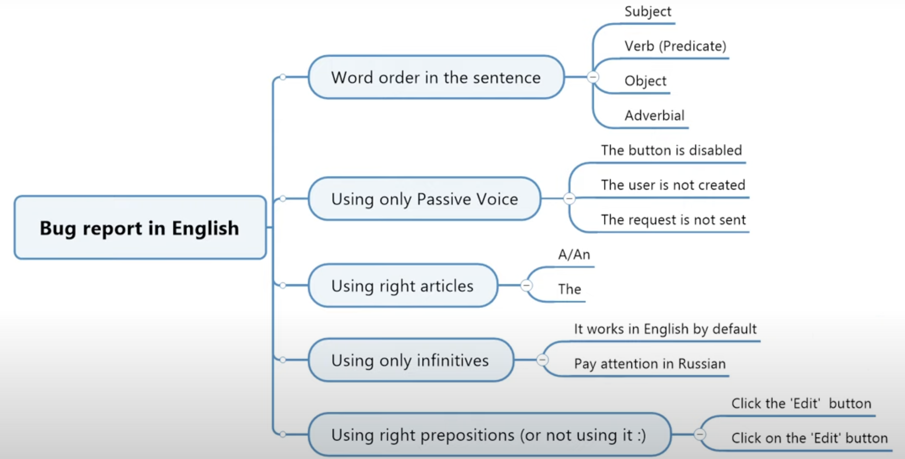

# [Course testing](https://stepik.org/course/171826)

# 1 Теория тестирования
  Теория
 ___

## 1.1 Про курс, отзывы и рейтинг
+ Информация о курсе, отзывы и рейтинг.
## 1.2 Вводный урок
> **Основная задача курса** - дать фундаментальные знания в области тестирования программного обеспечения.

## 
 1.3 Кто такой тестировщик? SDLC и STLC 

+ Описание роли тестировщика, жизненного цикла разработки ПО (SDLC) и жизненного цикла тестирования ПО (STLC).
+ Тестирование - это полноценная профессия, которая требует от будущего специалиста как глубокие технические навыки, так и набор личностных характеристик и предрасположенностей, так называемых софт-скиллов. 
## 1.4 Принципы тестирования
+ Тестирование может показать, что дефекты присутствуют, но не может доказать, что их нет.
+ Тестирование снижает вероятность наличия дефектов, находящихся в программном обеспечении, но, даже если дефекты не были обнаружены, тестирование не доказывает его корректности.

## 1.5 QA, QC, Testing. Верификация и валидация
> **Тестирование** - процесс в рамках жизненного цикла разработки программного обеспечения, который оценивает качество компонента или системы, а также связанных с ними рабочих продуктов. [ISTQB Glossary]
> **Тестирование программного обеспечения** — процесс анализа программного средства и сопутствующей документации с целью выявления дефектов и повышения качества продукта. [Святослав Куликов]
> **Тестирование ПО** — проверка соответствия между реальным и ожидаемым поведением программы [Что-то из интернета]
> **Контроль качества (QC)** - набор действий, предназначенных для оценивания качества компонента или системы. [ISTQB Glossary]
> **Обеспечение качества (QA)** - активности, направленные на обеспечение уверенности в том, что требования к качеству будут выполнены [ISTQB Glossary]
## 1.6 Уровни тестирования. Позитивные и негативные тесты
> **Интеграционное тестирование (integration testing)** - уровень тестирования, который фокусируется на взаимодействии между компонентами или системами
> **Системное тестирование** означает тестирование всей системы в целом, оно выполняется после интеграционного тестирования, чтобы проверить, работает ли вся система целиком должным образом. 
> 
## 1.7 Тестирование, связанное с изменениями
Тестирование, связанное с изменениями в программном обеспечении, необходимо для обеспечения стабильности и надежности продукта после внесения изменений или модификаций. Ключевые виды тестирования, применяемые для работы с изменениями:
- **Регрессионное тестирование**: Целью регрессионного тестирования является подтверждение, что изменения в коде не привели к новым дефектам в существующем функционале.
- **Санитарное тестирование**: Санитарное тестирование — это предварительная проверка новой сборки для оценки её стабильности перед глубоким тестированием.
- **Тестирование патчей**: Основное внимание уделяется проверке исправлений ошибок или обновлений безопасности.
- **Тестирование конфигурации**: Направлено на проверку правильности работы приложения в различных конфигурациях оборудования и программного обеспечения.
- **Тестирование сборок**: Подтверждает, что новая сборка приложения достаточно стабильна для начала процесса тестирования.
- **Тестирование производительности**: Проверяет, не ухудшилась ли производительность системы после внесения изменений.
- **Тестирование доступности и юзабилити**: Проводится для проверки соответствия стандартам доступности и удобства использования продукта конечными пользователями.
- **Тестирование безопасности**: Включает в себя проверку на уязвимости, которые могли появиться или быть устранены в результате изменений.
## 1.8 Типы тестирования. Часть 1
**Функциональное тестирование системы (functional testing)** включает тесты по оценке функций, которые должна выполнять система. Данный вид тестирования можно проводить на всех уровнях.
**Нефункциональное тестирование системы (non-functional testing)** выполняется для оценки таких характеристик системы и программного обеспечения, как удобство использования, производительность или безопасность.
**Тестирование на основе тест-кейсов (scripted testing, test case based testing)** — формализованный подход, в котором тестирование производится на основе заранее подготовленных тест-кейсов, наборов тест-кейсов и иной документации.
**Исследовательское тестирование (exploratory testing)** — частично формализованный подход, в рамках которого тестировщик выполняет работу с приложением по выбранному сценарию, который, в свою очередь, дорабатывается в процессе выполнения с целью более полного исследования приложения.
**Свободное (интуитивное) тестирование (ad hoc testing)** — полностью неформализованный подход, в котором не предполагается использования ни тест-кейсов, ни чек-листов, ни сценариев — тестировщик полностью опирается на свой профессионализм и интуицию (experience-based testing) для спонтанного выполнения с приложением действий, которые, как он считает, могут обнаружить ошибку. 
## 1.9 Типы тестирования. Часть 2
**Тестирование интернационализации (internationalization testing, i18n testing, globalization testing, localizability testing)** — тестирование, направленное на проверку готовности продукта к работе с использованием различных языков и с учётом различных национальных и культурных особенностей.

**Тестирование локализации (localization testing, l10n)** — тестирование, направленное на проверку корректности и качества адаптации продукта к использованию на том или ином языке с учётом национальных и культурных особенностей.
## 1.10 Модели разработки ПО
**Модель разработки ПО (Software Development Model, SDM)** — структура, систематизирующая различные виды проектной деятельности, их взаимодействие и последовательность в процессе разработки ПО. 
**Водопадная модель (waterfall model)** сейчас представляет скорее исторический интерес, т.к. в современных проектах практически неприменима, исключая авиастроение, военную или космическую отрасли, медицину и финансовый сектор. 
## 1.11 Анализ требований
**Требование (requirement)** -  условие, которое включает обязательные для выполнения критерии
**Идеальный процесс:**

    Требования создают бизнес-аналитики или владельцы продукта. Обычно они содержат в себе дизайнерские макеты.
    Требования попадают к тестировщику, который проверяет их на соответствие свойствам качественных требований. Дополнительно в Scrum есть Backlog Refinement, где требования обсуждаются и уточняются командой на отдельном собрании.
    В случае обнаружения неточностей, требования отправляются бизнес-аналитику на доработку, например, оставляется комментарий в системе.
    Пункты 2-3 повторяются до тех пор, пока не будут устранены несоответствия. Параллельно требования могут изучать другие участники команды: разработчики, дизайнеры
    После того как требования согласованы, они берутся в разработку, а тестировщики создают тестовую документацию для дальнейших проверок. Важно: тест-кейсы и чек-листы создаются до того, как функциональность из требования будет разработана. Вспоминаем Shift Left Testing и раннее тестирование. 
    Вносить изменения в требования после начала спринта не рекомендуется и по-хорошему должно быть запрещено.

## 1.12 Scrum
**Scrum** — легкий фреймворк, который помогает людям, командам и организациям создавать ценность с помощью адаптивных решений комплексных проблем.

**Ценности Scrum**

Успешное использование Scrum зависит от того, насколько люди разделяют пять ценностей:

приверженность, сфокусированность, открытость, уважение и смелость.
# 2 Техники тест-дизайна
> Хорошего тестировщика от плохого отличает умение проектировать оптимальные тесты, которые за минимальное количество шагов обеспечат максимальное тестовое покрытие. Именно для этого используется тест-анализ и тест-дизайн.
## 2.1 Классы эквивалентности и граничные значения
**Первый метод**
а) Тестирование нижней границы и значения до нее
б) Тестирование верхней границы и значения после нее
**Второй метод [описан Jorgensen 2014] [ISTQB CTFL Syllabus 2018 ]**
а) Тестирование нижней границы и значения как до нее, так и после нее
б) Тестирование верхней границы и значения как до нее, так и после нее
## 2.2 Попарное тестирование
**Попарное тестирование (pairwise testing)** - техника тестирования методом черного ящика, при которой тестовые сценарии разрабатываются таким образом, чтобы выполнить тестирование для всех комбинаций пар параметр-значение

Для формирования пар используется два подхода: ортогональные массивы и алгоритм All Pairs. В практике тестирования вы будете использовать последний, поэтому давайте сконцентрируемся на нем.
## 2.3 Таблица принятия решений, таблицы переходов и состояний
**Таблицы альтернатив (прим. синоним)** – хороший способ записи сложных бизнес-правил, которые должны быть реализованы в системе. В процессе создания таблицы, тестировщик определяет условия (входы) и результирующие действия системы (выходы). Пары условий и действий образуют строки таблицы, при этом условия указываются сверху, а действия – снизу. [ISTQB CTFL Syllabus 2018]
# 3 Тестовая документация
**На что стоит обратить внимание в первую очередь?**

    Структура и обязательные атрибуты. Большинство ошибок возникает по причине невнимательности, хотя каждый атрибут очень важен.
    Заголовки. У каждого вида документации есть свои требования к заголовкам. Короткое название проверки из чек-листа не подходит для тест-кейса. Заголовок кейса не подходит для баг-репорта, так как несет совсем другую функцию.
    Особенности использования систем для хранения документации. Вы должны научиться не только создавать документацию в специальных инструментах, но без проблем находить ее и понимать, на каких этапах SDLC она используется.

Помните, что ваша документация создается для команды, а не только для вас. Поэтому она должна быть понятная и не порождать новые вопросы.
## 3.1 Чек-листы и тест-кейсы
**Чек-листы** это набор идей для разработки программы.
**Тест-кейс** это нахождение и анализ дефекта, ошибки, отказа.
## 3.2 QASE. Обзор функций
##### [Ссылка на регистрацию в QASE](https://qase.io/)
## 3.3 TestIt. Обзор функций
[Ссылка на регистрацию TestIT](https://testit.software/)
## 3.4 Отчеты о дефектах. Jira
**Отчет о дефекте**

**Дефект (defect, bug, problem, fault)** — недостаток в компоненте или системе, способный привести к ситуации сбоя или отказа.

**Отчёт о дефекте (defect report, bug report)** — документ, описывающий и приоритизирующий обнаруженный дефект, а также содействующий его устранению.

**Атрибуты отчета о дефекте**
**Идентификатор:**  уникальный номер отчета. Присваивается автоматически в багтрекинговой системе (BTS, bug tracking system) 

**Краткое описание (summary):** отвечает на три вопроса: что, где, когда?  Что произошло? Где это произошло? При каких условиях?

**Подробное описание (description):** информация о дефекте в развернутом виде + фактический и ожидаемый результат + ссылка на требование

**Шаги по воспроизведению (steps to reproduce, STR)**
**Окружение (environment):** информация о среде, на которой был обнаружен баг (версия ОС, браузера, мобильного устройства)
**Важность (severity)** - степень ущерба, который наносится проекту существованием дефекта. Серьезность для разрабатываемого ПО.
## 3.5 Как писать отчет о дефекте на английском языке?
[изображение]()
## 3.6 Ошибки, сбои, отказы, улучшения

## 3.7 Azure Devops. Обзор функций

  [Ссылка на регистрацию в Azure Devops](https://azure.microsoft.com/en-us/pricing/details/devops/azure-devops-services/)
 [Ссылка на документацию](https://docs.microsoft.com/en-us/azure/devops/test/?view=azure-devops)

## 3.8 Youtrack. Обзор функций
[Ссылка на регистрацию в Youtrack](https://www.jetbrains.com/youtrack/)
## 3.9 Оценка трудозатрат (эстимация) в тестировании
**Популярные техники оценки трудозатрат (эстимации)**

    Пальцем в небо (метод проб и ошибок)
    Процентное отношение к разработке (например, на 1 тестировщика приходится 2-3 разработчика; значит на тестирование тратится в 2-3 раза меньше времени, чем на разработку)
    Процентное распределение, при котором на все фазы SDLC выделяется определенный процент времени. Время выделенное на тестирование, разделяется на отдельные фазы STLC.
    Эстимация, основанная на предыдущем опыте
    Структурная декомпозиция, при которой крупные задачи разделяются на более мелкие, которые легко оценить
    Эстимация по трем точкам

## 3.10 Тест-план, тестовая стратегия, отчет по результатам тестирования
**План тестирования (test plan)** - документация, описывающая цели тестирования, которые должны быть достигнуты, средства и график их достижения, организованная для координации тестовой деятельности. [ISTQB Glossary]
**Структура тест-плана**

    Цель (purpose)
    Области, подвергаемые тестированию (features to be tested)
    Области, не подвергаемые тестированию (features not to be tested)
    Тестовая стратегия (test strategy) и подходы (test approach)
    Критерии (criteria). Чаще всего это критерии начала и завершения тестирования
    Ресурсы (resources): программные, аппаратные, человеческие, финансовые
    Расписание (test schedule)
    Роли и ответственность (roles and responsibility)
    Оценка рисков (risk evaluation)
    Документация (documentation)
    Метрики (metrics) - числовые характеристики показателей качества

## 3.11 Метрики в тестировании. Матрица трассировки
**Матрица трассируемости (traceability matrix, RTM)** - двумерная таблица, описывающая связь двух сущностей (например, требований и тестовых сценариев). Таблица позволяет производить прямую и обратную трассировку от одной сущности к другой, обеспечивая таким образом возможность определения покрытия и оценки влияния предполагаемых изменений. [ISTQB Glossary]

Базовая матрица служит для визуальной оценки тестового покрытия, где указаны требования и тест-кейсы, проверяющие их.

На пересечение ставится метка, благодаря которой можно принять решение об оптимизации количества кейсов для проверки требования.
## 3.12 Типичные ошибки в тестовой документации
[Video](https://odysee.com/@artsiomrusau.qalife:e/%D1%82%D0%B5%D1%81%D1%82%D0%BE%D0%B2%D0%B0%D1%8F-%D0%B4%D0%BE%D0%BA%D1%83%D0%BC%D0%B5%D0%BD%D1%82%D0%B0%D1%86%D0%B8%D1%8F-2:c?r=E7qK8t1j2aJ2kNXaYGAjGdpWWEZZWEnx)
# 4 Тестирование веб-приложений

## 4.1 Клиент-серверная архитектура
**Клиент-серверная архитектура** - вычислительная или сетевая архитектура, в которой задания или сетевая нагрузка распределены между поставщиками услуг, называемыми серверами, и заказчиками услуг, называемыми клиентами. 

Фактически **клиент и сервер** - это программное обеспечение. Обычно эти программы расположены на разных вычислительных машинах и взаимодействуют между собой через вычислительную сеть посредством сетевых протоколов, но они могут быть расположены также и на одной машине. Программы-серверы ожидают от клиентских программ запросы и предоставляют им свои ресурсы в виде: данных (например, загрузка файлов посредством HTTP, FTP, BitTorrent, потоковое мультимедиа или работа с базами данных); сервисных функций (например, работа с электронной почтой, общение посредством систем мгновенного обмена сообщениями или просмотр web-страниц во всемирной паутине).

Поскольку одна программа-сервер может выполнять запросы от множества программ-клиентов, ее размещают на специально выделенной вычислительной машине, настроенной особым образом, как правило, совместно с другими программами-серверами, поэтому производительность этой машины должна быть высокой. Из-за особой роли такой машины в сети, специфики ее оборудования и программного обеспечения, её также называют сервером, а машины, выполняющие клиентские программы, соответственно, клиентами.
Как работает данная модель простыми словами?

    Клиент (браузер, мобильное приложение) отправляет HTTP-запрос к серверу. Пользователь ввел запрос в поисковую строку интернет-магазина
    Сервер обрабатывает запрос и присылает HTTP-ответ клиенту. Сервер магазина обработал запрос и обратился к базе данных в поиске искомого товара (см. шаг 3). После этого сервер вернул массив карточек товаров в ответе и пользователь увидел их на клиенте (в браузере).
    Если необходимо получить данные, которые сохраняются в базе данных, то сервер обращается к базе и получает ответ от нее. Сервер базы данных обработал запрос и выдал серверу идентификаторы товаров, которые подходят поисковому запросу.

## 4.2 HTTP-протокол
**HTTP (HyperText Transfer Protocol)** — протокол прикладного уровня передачи данных, изначально — в виде гипертекстовых документов в формате HTML, в настоящее время используется для передачи произвольных данных. 

Существует три версии этого протокола. На данный момент большинство веб-приложений работают по HTTP 2.0 и HTTP 3.0.

**TCP (Transmission Control Protocol - протокол управления передачей)**, является надежным протоколом с установлением соединений, позволяющим без ошибок доставлять байтовый поток с одной машины на любую другую машину объединенной сети. Используется для передачи электронных сообщений, отправка файлов.

**UDP (User Datagram Protocol** - протокол пользовательских дейтаграмм), является ненадежным протоколом без установления соединения, не использующим последовательное управление потоком протокола TCP, а предоставляющим свое собственное. Он также широко используется в одноразовых клиент-серверных запросах и приложениях, в которых оперативность важнее гарантии отправки всех данных, например при передаче речи и видео (стриминг, онлайн-игры).
## 4.3 URL, IP, DNS. Кэш и куки
**IP-адрес (IP - Internet Protocol)** - уникальный адрес устройства в сети. 

Есть две версии: IPv4 и  IPv6

Адреса IPv4 записываются в виде четырёх чисел, разделённых точками, например: 192.168.2.10. Это 32-битный адрес.

Ввиду ограниченного количества IPv4 в 1999 году была представлены 128-битная версия адреса IPv6. Например, 3ffe: 1900: fe21: 4545: 0000: 0000: 0000: 0000.
**Доменные имена** - ключевая составляющая инфраструктуры Интернета. Они предоставляют человеко-читаемые адреса веб-серверов, доступных в Интернете. 
**MAC-адрес** — уникальный идентификатор, присваиваемый каждой единице активного оборудования или некоторым их интерфейсам в компьютерных сетях Ethernet. 

По сути это номер сетевой карты, аппаратный номер оборудования. Если у устройства есть выход в интернет значит в нем обязательно есть сетевая карта.
**URL (Uniform Resource Locator)** - адрес, который выдан уникальному ресурсу в интернете. 
**DNS** ― это система, которая позволяет браузеру найти запрошенный пользователем сайт по имени домена.

Работу с DNS-сервером можно описать так:

    Ввод адреса целевого сайта в адресную строку в браузере
    Обращение к DNS-кэшу (временное хранилище) на вашем компьютере или провайдере: знает ли он какому IP соответствует домен. Если такое имя есть, то вы переходите на целевой ресурс. 
    Если в кэше этой информации нет, то компьютер обращается к DNS-серверу.

## 4.4 Работа с Devtools
## 4.5 Основы HTML и CSS для тестировщика
**HTML (HyperText Markup Language — «язык гипертекстовой разметки»):**

    HTML используется для верстки веб-страницы и определяет, что именно будет на ней находиться и в каком порядке.
    Вы можете найти HTML определенной страницы в DevTools во вкладке Elements.
    Если у вас есть доступ к коду приложения, то информацию об HTML можно найти в файле index.html.
**CSS (Cascading Style Sheets - «каскадные таблицы стилей»)**

    CSS задает стиль элементов на веб-странице.
    Информацию о стилях можно найти в DevTools во вкладке Elements > Styles.
    Свойство color: Меняет цвет текста, например, color: red; сделает текст красным.
    Свойство background-color: Устанавливает цвет фона, например, background-color: blue;.
    Свойство font-size: Определяет размер текста, например, font-size: 16px; установит размер шрифта в 16 пикселей.
    Можно применять CSS в HTML через тег <style> или в отдельном файле с расширением styles.css.
## 4.6 Тестирование полей ввода и веб-форм
Всегда помните, что сначала нужно проводить позитивное тестирование с валидными данными, а уже после использовать негативные кейсы и вызывать ошибки. Не забывайте проверять валидации как на клиенте, так и на сервере.

    Тестирование текстовых полей:
        Примеры: Тестирование ввода специальных символов, валидация пустых полей.

    Тестирование тегов в полях ввода:
        Примеры: Ввод HTML-тегов, например <script>, для проверки уязвимостей XSS, ввод CSS для проверки его обработки.

    Тестирование полей для URL:
        Примеры: Тестирование ввода невалидных URL, например с неправильными протоколами или символами.

    Тестирование загрузки файлов:
        Примеры: Загрузка файлов с невалидными расширениями, тестирование ограничений на размер файла.

    Тестирование полей ввода номеров телефонов:
        Примеры: Ввод номеров с недопустимыми символами, тестирование международных форматов номеров.

    Тестирование полей для email:
        Примеры: Тестирование ввода корректного email, email без символа "@", ввод email с некорректным доменом.

    Тестирование полей для ввода паролей:
        Примеры: Тестирование паролей с недостаточной сложностью, тестирование функции восстановления пароля.

    Тестирование капчи:
        Примеры: Проверка работы капчи при неверном вводе, тестирование обновления изображения капчи.

    Тестирование динамических элементов:
        Примеры: Проверка обновления содержимого страницы при изменении данных в форме без перезагрузки, тестирование слайдеров на чувствительность и точность.

    Многостраничные формы:
        Примеры: Проверка сохранения введенных данных при переходе между страницами формы, тестирование возвращения к предыдущим шагам без потери данных.
    Тестирование чекбоксов и радио-кнопок:
        Примеры: Проверка возможности выбора и снятия выбора, тестирование взаимоисключающего выбора в группе радио-кнопок.

    Тестирование календаря:
        Примеры: Тестирование ограничений на выбор дат, проверка корректности ввода дат вручную и через виджет календаря.

    Тестирование выпадающих списков (Dropdowns):
        Примеры: Проверка всех доступных опций в выпадающем списке, тестирование поведения при выборе различных опций.

    Адаптивность:
        Примеры: Тестирование отображения форм на мобильных устройствах, проверка работы форм в разных ориентациях экрана (портретной и ландшафтной).

    Кросс-браузерное тестирование:
        Примеры: Проверка совместимости форм в различных версиях и типах браузеров, включая старые версии.

    Доступность и Usability:
        Примеры: Тестирование использования формы с помощью скринридеров, оценка интуитивности интерфейса и легкости взаимодействия с элементами.

## 4.7 Работа с логами
**Логи** - это документация, фиксирующая информацию о действиях пользователя, приложения, системы или сервера, включая время их выполнения.

**Выделяют следующие типы логов:** логи приложений, серверные логи и системные логи.

Логи приложений относятся к действиям в приложениях (например, браузеры или мобильные приложения), серверные логи — к взаимодействиям с сервером, системные логи — к работе операционной системы.

Уровни Логирования:

    OFF: Без логирования.
    FATAL: Ошибки, делающие дальнейшую работу системы невозможной.
    ERROR: Некритические ошибки, требующие исправления.
    WARNING: Предупреждения, могут привести к ошибкам в будущем.
    INFO: Информационные сообщения о стандартных операциях.
    DEBUG: Все вышеуказанные уровни плюс дополнительная отладочная информация.
    TRACE: Максимальный уровень детализации, фиксирует практически все процессы в системе.

**Применение в тестировании**

    Анализ ошибок: Использование логов для идентификации и анализа ошибок.
    Интеграционное тестирование: Мониторинг взаимодействия между компонентами системы через логи.
    Производительность: Оценка влияния логирования на производительность системы.
    Безопасность. Важность исключения персональных и чувствительных данных из логов, проверка этого.
# 5 Тестирование API. Работа с Postman
## 5.1 Тестирование веб-сервисов. SOAP и REST. Теория 

## 5.2 Тестирование веб-сервисов. SOAP и REST. Практика 

## 5.3 Что такое API простыми словами?

## 5.4 Базовая настройка Postman 

## 5.5 Переменные и окружения 

## 5.6 Встроенные автотесты 

## 5.7 Переменные в CSV и JSON. Тестирование SOAP в Postman 

## 5.8 Перехват HTTP и HTTPs 

## 5.9 Обзор функций Postman 2023 

# 6 Работа с реляционными базами данных 

## 6.1 Что такое БД и СУБД? Нормальные формы 

## 6.2 Создание, удаление, изменение таблиц в MySQL 

## 6.3 SELECT в MySQL 

## 6.4 JOIN в MySQL 

## 6.5 Импорт, экспорт данных. HAVING и UNION 

# 7 Тестирование мобильных приложений 

## 7.1 Типы мобильных приложений 

## 7.2 Эмулятор Android Studio 

## 7.3 Особенности тестирования мобильных приложений 

## 7.4 Работа с Charles Proxy 

## 7.5 Работа с Fiddler 

# 8 Доп: Работа с git 

## 8.1 Что такое git и github? 

## 8.2 Установка и настройка git и github 

## 8.3 Базовые команды git. Отслеживание изменений 

## 8.4 git commit, git reset, git checkout, git stash 

## 8.5 Работа с ветками 

## 8.6 git flow, git gui, gitk 

## 8.7 Создание портфолио 

# 9 Доп: Работа с bash 

## 9.1 Установка и настройка bash 

## 9.2 Работа с файлами и папками 

## 9.3 Текстовые редакторы 

## 9.4 Поиск файлов 

## 9.5 Команды с выводом и процессами 

## 9.6 Команды ping и curl 

# 10 Доп: Управление процессом тестирования + CI/CD  

 ## 10.1 Как настроить QA Proccess с нуля?  

 ## 10 .2 Тестовые окружения  

 ## 10 .3 CI/CD для тестировщика + демо в Jenkins  

# 11 Доп: Трудоустройство  

 ## 11 .1 Как создать резюме?  

 ## 11 .2 Как создать профиль в LinkedIn?  

 ## 11 .3 Как проходят собеседования на позицию Junior QA?  

 ## 11 .4 Ответы на вопросы к собеседованиям  

 ## 11 .5 Что спросить на собеседовании у компании?  

 ## 11 .6 Где брать практику и опыт?  

 ## 11 .7 Типы компаний  

 ## 11 .8 Оценка эффективности и пересмотр заработной платы  

 ## 11 .9 Один день из жизни тестировщика  

 ## 11 .10 Выдача сертификата и отзыв  

# 12 Итоговое тестирование - тренажер  

 ## 12 .1 Теория тестирования  

 ## 12 .2 Техники тест-дизайна  

 ## 12 .3 Тестовая документация  

 ## 12 .4 Тестирование веб-приложений  

 ## 12 .5 Тестирование API  

 ## 12 .6 Работа с базами данных  

 ## 12 .7 Тестирование мобильных приложений  

 ## 12 .8 Работа с git и bash  
